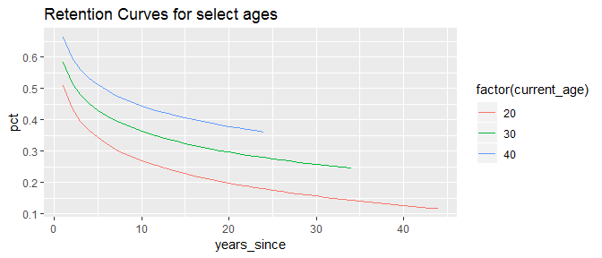

<!-- nc-analysis.md is generated from nc-analysis.Rmd. Please edit that file -->
NC Analysis Overview
====================

The lifetime package includes a set of wrapper functions that were used to streamline the analysis for the NC project, located on the Data Server (E:/SA/Projects/NCWRC-19-01). This vignette provides an example of estimating results for 1 of the 4 license types examined for NC (making use of data stored on the server).

Get Data
--------

Pulling license data:

``` r
library(tidyverse)
library(lifetime)
library(DBI)

db_license <- "E:/SA/Data-production/NCWRC-19-01/license.sqlite3"
con <- dbConnect(RSQLite::SQLite(), db_license)
lic <- tbl(con, "lic") %>% collect()
sale <- tbl(con, "sale") %>% select(cust_id:year, res) %>% collect()
hunt <- tbl(con, "hunt") %>% collect()
dbDisconnect(con)
```

Analysis parameters:

``` r
return_life <- 0.05 # annual return to lifetime fund
inflation <- 0.0219 # inflation rate for fund depreciation
ages <- 16:63 # buyer ages to be included in retention modelling
senior_price <- 15 # lifetime license price at age 65

prices <- tibble(
    current_age = 0:63, price_lifetime = rep(250, 64), price_annual = rep(36, 64)
)
wsfr_amount <- 16.25 # WSFR aid per certified hunter
min_amount <- 2 # WSFR mimimum revenue per year
```

Prep Data
---------

The first step just involves preparing the necessary license data (oulined in the [retention vignette](retention.md)).

``` r
df_split <- hunt %>%
        yrs_lifetime_join(sale, lic, "comp_hunt") %>%
        yrs_zero_split() %>%
        yrs_zero_filter(function(x) filter(x, life_group == "comp_hunt", res == 1))

glimpse(df_split$year0)
#> Observations: 111,691
#> Variables: 9
#> $ cust_id      <int> 1758853, 3169450, 1772999, 4569840, 1791515, 1908...
#> $ year         <int> 2008, 2008, 2008, 2008, 2008, 2008, 2008, 2008, 2...
#> $ res          <int> 1, 1, 1, 1, 1, 1, 1, 1, 1, 1, 1, 1, 1, 1, 1, 1, 1...
#> $ age_year     <int> 22, 20, 50, 24, 43, 33, 42, 33, 47, 48, 57, 17, 1...
#> $ lapse        <int> 0, 0, 0, 0, 0, 0, 1, 1, 0, 0, 0, 0, 0, 0, 0, 0, 0...
#> $ R3           <int> NA, NA, NA, NA, NA, NA, NA, NA, NA, NA, NA, NA, N...
#> $ duration_run <int> 1, 1, 1, 1, 1, 1, 1, 1, 1, 1, 1, 1, 1, 1, 1, 1, 1...
#> $ duration     <int> 1, 1, 1, 1, 1, 1, 1, 1, 1, 1, 1, 1, 1, 1, 1, 1, 1...
#> $ life_group   <chr> "comp_hunt", "comp_hunt", "comp_hunt", "comp_hunt...

glimpse(df_split$history)
#> Observations: 265,292
#> Variables: 2
#> $ cust_id <int> 4576011, 4293971, 4299566, 2051119, 1850737, 4256198, ...
#> $ year    <int> 2008, 2008, 2008, 2008, 2008, 2008, 2008, 2008, 2008, ...
```

Calculate Retention
-------------------

There are wrapper functions to calculate retention across all selected ages (16-63) in the `df_split` dataset.

``` r
observe_all <- nc_retain_all(df_split, ages, use_observed = TRUE)
retain_all <- nc_retain_all(df_split, ages)
retain <- nc_retain(retain_all)

ggplot(retain, aes(current_age, yrs)) + 
    geom_point() +
    ggtitle("Estimated future participation years by age")
```



Calculate Revenue
-----------------

The NC revenue calculations include a step to also estimate for those aged 0-16 (for whom we can't observe retention), although it can be overridden with `youth_ages = NULL`. Assumptions used:

-   Annual: Infant/youth will exactly follow the 16-year-old retention curve (starting at age 16). Before 16, licenses aren't needed.

``` r
annual <- nc_annual(retain_all, prices, wsfr_amount, min_amount, senior_price) # include wsfr
annual <- nc_annual(retain_all, prices, wsfr_amount = NULL) # ignore wsfr

glimpse(annual)
#> Observations: 64
#> Variables: 3
#> $ current_age    <int> 0, 1, 2, 3, 4, 5, 6, 7, 8, 9, 10, 11, 12, 13, 1...
#> $ stream         <chr> "lic_revenue", "lic_revenue", "lic_revenue", "l...
#> $ revenue_annual <dbl> 541.5209, 541.5209, 541.5209, 541.5209, 541.520...
```

-   Lifetime: Infant/Youth lifetime licenses are able to compound until age 16 (before which the fund return can't be used as revenue).

``` r
lifetime <- nc_lifetime(prices, return_life, inflation, wsfr_amount, min_amount) # include wsfr
lifetime <- nc_lifetime(prices, return_life, inflation, wsfr_amount = NULL) # ignore wsfr

glimpse(lifetime)
#> Observations: 64
#> Variables: 3
#> $ current_age      <int> 0, 1, 2, 3, 4, 5, 6, 7, 8, 9, 10, 11, 12, 13,...
#> $ stream           <chr> "lic_revenue", "lic_revenue", "lic_revenue", ...
#> $ revenue_lifetime <dbl> 889.2659, 864.9605, 841.3194, 818.3245, 795.9...
```

Identify Break-even Prices
--------------------------

A function is included which uses a solver (`stats::optimize()`) to determine the lifetime license price where Revenue|Annual ~= Revenue|Lifetime

``` r
break_even_wsfr <- nc_break_even(
    retain_all, prices, return_life, inflation, wsfr_amount, min_amount, senior_price
)
break_even <- nc_break_even(
    retain_all, prices, return_life, inflation, wsfr_amount = NULL
)

glimpse(break_even)
#> Observations: 64
#> Variables: 2
#> $ current_age <int> 0, 1, 2, 3, 4, 5, 6, 7, 8, 9, 10, 11, 12, 13, 14, ...
#> $ break_even  <dbl> 152.2382, 156.5160, 160.9142, 165.4359, 170.0846, ...
```

Identify years to Break-even
----------------------------

The relevant wrapper function calculates revenue streams under alternative scenarios, and identifies the first year in which cumulative revenue in the lifetime scenario exceeds that of the annual scenario (if ever).

``` r
break_even_yrs_wsfr <- nc_break_even_yrs(
    retain_all, prices, return_life, inflation, wsfr_amount, min_amount, senior_price
)
break_even_yrs <- nc_break_even_yrs(
    retain_all, prices, return_life, inflation, wsfr_amount = NULL
)

glimpse(break_even_yrs)
#> Observations: 64
#> Variables: 5
#> $ current_age       <int> 0, 1, 2, 3, 4, 5, 6, 7, 8, 9, 10, 11, 12, 13...
#> $ age_year          <dbl> 38, 43, 51, 65, 68, 71, 74, 77, 81, 85, 90, ...
#> $ revenue_annual    <dbl> 342.4663, 388.4309, 453.3759, 541.5209, 541....
#> $ revenue_lifetime  <dbl> 342.9255, 389.2483, 453.7273, 541.8181, 544....
#> $ yrs_to_break_even <dbl> 38, 42, 49, 62, 64, 66, 68, 70, 73, 76, 80, ...
```
