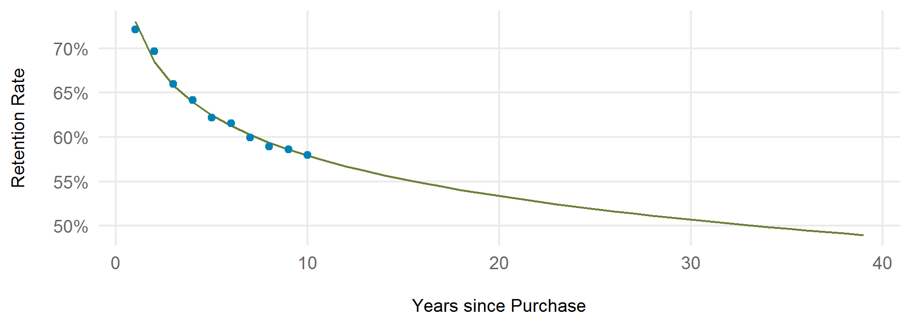

<!-- retention.md is generated from retention.Rmd. Please edit that file -->

```{r, include = FALSE, message = FALSE}
knitr::opts_chunk$set(
  collapse = TRUE,
  comment = "#>"
)
library(tidyverse)
library(lifetime)
```

## Retention Overview

Estimating revenue in the annual purchase scenario fundamentally depends upon predicting the number of years a customer will buy licenses in the future. The method presented here uses retention rates (% of buyers in one year who buy licenses in subsequent years). 

### Retention Curves

Retention curves can be constructed from observed retention rates, and these always slope downward. The example below is pulled from the NC report Appendix, and uses linear regression fit to 10 years of observed retention rates for hunters aged 45 in year zero. This vignette walks through the R functions used to estimate such retention curves.



## Data Standardization

The functions in package lifetime expect that license data has been prepared in a way consistent with the structure described in [package salic](https://southwick-associates.github.io/salic/articles/salic.html). Sample data in the salic standard format is provided in this package, which is based on a customer sample.

```{r}
library(tidyverse)
library(lifetime)
data(cust, lic, sale)
```

Note that the license type table has an extra field (`life_group`) for identifying types of interest for lifetime pricing analysis (only "sportsman" was included in sample data).

```{r}
glimpse(sale)

glimpse(lic)

glimpse(cust)
```

There is also a license history table (overall "hunt or fish" privilege) for these customers, where each customer has a single row per year a privilege was held. This structure is important for retention calculations in this package.

```{r}
data(all_sports)
glimpse(all_sports)
```

## Simple Retention Calculation

The basis of retention is the focus on a "year zero" reference year with known license holders. For example, for year0 = 2008, year1 = 2009, year2 = 2010 (etc), we can pretty easily calculate a retention curve with a custom function:

```{r}
calc_retain <- function(all_sports, year0) {
    all_sports_year0 <- filter(all_sports, year == year0)
    semi_join(all_sports, all_sports_year0, by = "cust_id") %>% 
        count(year) %>%
        mutate(retain_rate = n / nrow(all_sports_year0))
}
calc_retain(all_sports, 2008) %>% head(3)
```

Our function doesn't work though if we want to use 2009 for year0. 

```{r}
calc_retain(all_sports, 2009) %>% head(3)
```

## Data Preparation

We could modify the above function, but filtering problems can also crop-up in downstream calculations. To streamline filtering customers of interest, package lifetime uses `yrs_zero` preparation functions that incorporate a split operation to separate license history into 2 components: (1) a "year0" customer table used as reference for filtering, and (2) a "history" table for calculating retention.

```{r}
df_split <- yrs_zero_split(all_sports)
lapply(df_split, function(x) head(x, 2))
```

We then use `yrs_zero_filter()` with `yrs_calc_retain` to calculate the 2008 retention curve:

```{r}
df_split %>%
    yrs_zero_filter(function(x) filter(x, year == 2008)) %>%
    yrs_calc_retain() %>% 
    head(2)
```

## Retention Calculation

The "split" paradigm is more useful for more complex cases. Say we want to look at those aged 25 to 35, but wish to include all available data possible (year0 = 2008, 2009, ...):

```{r, fig.height=3}
df_split <- df_split %>% 
    yrs_zero_filter(function(x) filter(x, age_year %in% 25:35))
retain_observe <- yrs_calc_retain(df_split)

p <- ggplot(retain_observe, aes(years_since, pct)) + 
    geom_line() +
    geom_point() +
    ggtitle("Retention for sportsman aged 25 to 35")
p
```

The plot below demonstrates the use of multiple year zeroes with the `yrs_calc_retain()` grouping option. By default, the function will average across all available year zeroes (like the plot above). The data below look noisy partly due to the customer sample.

```{r, fig.height = 3}
retain_observe_multi <- yrs_calc_retain(df_split, year0)
p + geom_point(data = retain_observe_multi, aes(color = year0))
```

## Regression Modelling

With license data, we are faced with a limited stretch of time (e.g., 10 years) for calculating retention. To extrapolate further we can use a simple regression model. A logarithmic relationship seems to provide a decent fit to the time trend.

```{r, fig.height = 3}
model_fit <- lm(pct ~ log(years_since), data = retain_observe)
retain_predict <- data.frame(years_since = 1:34)
retain_predict$pct <- predict(model_fit, retain_predict)

ggplot(retain_predict, aes(years_since, pct)) + 
    geom_line() +
    geom_point(data = retain_observe)
```

The total estimated years of hunting/fishing over this 34-year period is just the sum of the predicted retention rates:

```{r}
sum(retain_predict$pct)
```

## Full Calculation

Package lifetime includes `yrs_result` convenience functions that wrap up the retention modelling steps for analysis. Here we are using the hunting/fishing permission data for those aged 25 to 35 to predict future years (till age 64) for 30-year-olds.

- Note that we also use `yrs_lifetime_join()` to specifically identify sportsman license buyers (and filter accordingly). Although this has no effect on the pre-filtered sample data, one would likely use this approach in the actual analysis.

- For analysis we would also run every single age separately (i.e., use `age_year == 30` below) but the sample data is too noisy for a nice demonstration.

```{r, fig.height=4}
df_split <- all_sports %>%
    yrs_lifetime_join(sale, lic, "sportsman") %>%
    yrs_zero_split() %>%
    yrs_zero_filter(function(x) {
        filter(x, age_year %in% 25:35, life_group == "sportsman")
    })

observe <- yrs_result_observe(df_split, predict_age = 30)
retain <- yrs_result_retain(df_split, predict_age = 30, end_age = 64)

yrs_plot(retain) + 
    geom_point(data = observe) + 
    ggtitle("Retention curve for 30-year-old sportsman buyers")
```
