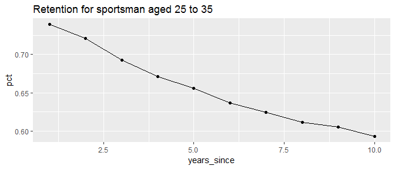
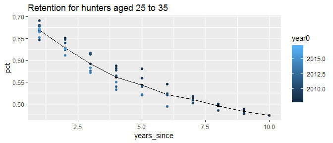
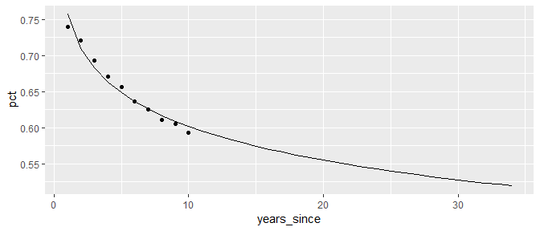
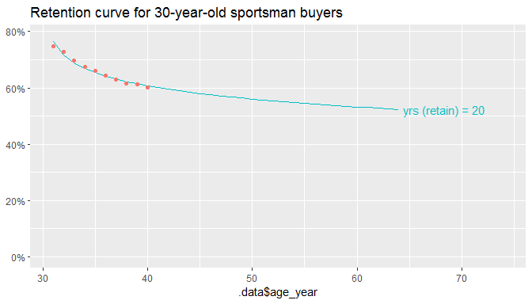
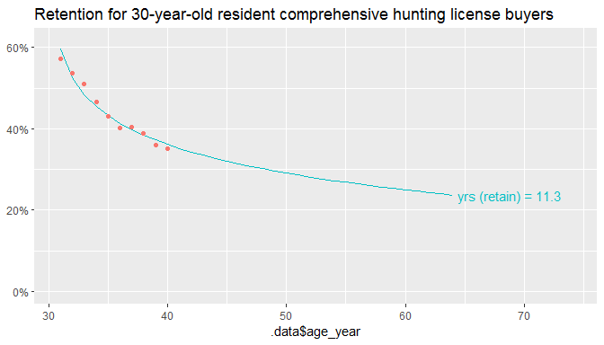

<!-- retention.md is generated from retention.Rmd. Please edit that file -->
Retention Overview
------------------

Estimating revenue in the annual purchase scenario fundamentally depends upon predicting the number of years a customer will buy licenses in the future. The method presented here uses retention rates (% of buyers in one year who buy licenses in subsequent years).

### Retention Curves

Retention curves can be constructed from observed retention rates, and these always slope downward. The example below is pulled from the NC report Appendix, and uses linear regression fit to 10 years of observed retention rates for hunters aged 45 in year zero. This vignette walks through the R functions used to estimate such retention curves.


Data Standardization
--------------------

The functions in package lifetime expect that license data has been prepared in a way consistent with the structure described in [package salic](https://southwick-associates.github.io/salic/articles/salic.html). Sample data in the salic standard format is provided in this package, which is based on a 100,000 customer sample.

``` r
library(tidyverse)
library(lifetime)
data(cust, lic, sale)
```

Note that the "lic" table has an extra field (life\_group) for identifying license types of interest for lifetime pricing analysis.

``` r
sale %>%
    left_join(lic, by = "lic_id") %>% 
    left_join(cust, by = "cust_id") %>%
    head(2)
#> # A tibble: 2 x 8
#>   cust_id lic_id  year life_group duration   sex birth_year cust_res
#>     <int>  <dbl> <int> <chr>         <int> <int>      <int>    <int>
#> 1 1992994     64  2008 sportsman         1     1       1984        1
#> 2 2410481     64  2008 sportsman         1     1       1946        1
```

There is also a license history table (hunting privilege) for these 100k customers.

``` r
data(hunt)
head(hunt, 2)
#> # A tibble: 2 x 4
#>   cust_id  year   res age_year
#>     <int> <int> <int>    <int>
#> 1 6789209  2011     1       32
#> 2 6789209  2012     1       33
```

Simple Retention Calculation
----------------------------

The basis of retention is the focus on a "year zero" reference year with known license holders. For example, for year0 = 2008, year1 = 2009, year2 = 2010 (etc), we can pretty easily calculate a retention curve with a custom function:

``` r
calc_retain <- function(hunt, year0) {
    hunt_year0 <- filter(hunt, year == year0)
    semi_join(hunt, hunt_year0, by = "cust_id") %>% 
        count(year) %>%
        mutate(retain_rate = n / nrow(hunt_year0))
}
calc_retain(hunt, 2008) %>% head(3)
#> # A tibble: 3 x 3
#>    year     n retain_rate
#>   <int> <int>       <dbl>
#> 1  2008  6912       1    
#> 2  2009  4594       0.665
#> 3  2010  4528       0.655
```

Our function doesn't work though if we want to use 2009 for year0.

``` r
calc_retain(hunt, 2009) %>% head(3)
#> # A tibble: 3 x 3
#>    year     n retain_rate
#>   <int> <int>       <dbl>
#> 1  2008  4594       0.643
#> 2  2009  7146       1    
#> 3  2010  5141       0.719
```

Data Preparation
----------------

We could modify the above function, but filtering problems can also crop-up in downstream calculations. To streamline filtering customers of interest, package lifetime uses `yrs_zero` preparation functions that incorporate a split operation to separate license history into 2 components: (1) a "year0" customer table used as reference for filtering, and (2) a "history" table for calculating retention.

``` r
hunt_split <- yrs_zero_split(hunt)
lapply(hunt_split, function(x) head(x, 2))
#> $year0
#> # A tibble: 2 x 4
#>   cust_id  year   res age_year
#>     <int> <int> <int>    <int>
#> 1 6789209  2011     1       32
#> 2 6789209  2012     1       33
#> 
#> $history
#> # A tibble: 2 x 2
#>   cust_id  year
#>     <int> <int>
#> 1 6789209  2011
#> 2 6789209  2012
```

We then use `yrs_zero_filter()` with `yrs_calc_retain` to calculate the 2008 retention curve:

``` r
hunt_split %>%
    yrs_zero_filter(function(x) filter(x, year == 2008)) %>%
    yrs_calc_retain() %>% 
    head(2)
#> # A tibble: 2 x 3
#>   years_since   pct    n0
#>         <int> <dbl> <int>
#> 1           1 0.665  6912
#> 2           2 0.655  6912
```

Retention Calculation
---------------------

The "split" paradigm is more useful for more complex cases. Say we want to look at those aged 25 to 35, but wish to include all available data possible (year0 = 2008, 2009, ...):

``` r
hunt_split <- hunt_split %>% 
    yrs_zero_filter(function(x) filter(x, age_year %in% 25:35))
retain_observe <- yrs_calc_retain(hunt_split)

p <- ggplot(retain_observe, aes(years_since, pct)) + 
    geom_line() +
    geom_point() +
    ggtitle("Retention for hunters aged 25 to 35")
p
```



The plot below demonstrates the use of multiple year zeroes with the `yrs_calc_retain()` grouping option. By default, the function will average across all available year zeroes (like the plot above).

``` r
retain_observe_multi <- yrs_calc_retain(hunt_split, year0)
p + geom_point(data = retain_observe_multi, aes(color = year0))
```



Regression Modelling
--------------------

With license data, we are faced with a limited stretch of time (e.g., 10 years) for calculating retention. To extrapolate further we can use a simple regression model. A logarithmic relationship seems to provide a decent fit to the time trend.

``` r
model_fit <- lm(pct ~ log(years_since), data = retain_observe)
retain_predict <- data.frame(years_since = 1:34)
retain_predict$pct <- predict(model_fit, retain_predict)

ggplot(retain_predict, aes(years_since, pct)) + 
    geom_line() +
    geom_point(data = retain_observe)
```



The total estimated years of hunting over this 34-year period is just the sum of the predicted retention rates:

``` r
sum(retain_predict$pct)
#> [1] 15.30437
```

Full Calculation
----------------

Package lifetime includes `yrs_result` convenience functions that wrap up the retention modelling steps for analysis. Here we are using the hunting permission data for those aged 25 to 35 to predict future years (till age 64) for 30-year-olds:

``` r
hunt_split <- hunt %>%
    yrs_zero_split() %>%
    yrs_zero_filter(function(x) filter(x, age_year %in% 25:35))

estimate_and_plot <- function(hunt_split) {
    observe <- yrs_result_observe(hunt_split, predict_age = 30)
    retain <- yrs_result_retain(hunt_split, predict_age = 30, end_age = 64)
    yrs_plot(retain) + geom_point(data = observe)
}
estimate_and_plot(hunt_split) + ggtitle("Retention curve for 30-year-old hunters")
```



We also might be interested in focusing further. For example on residents who buy the comprehensive license; we use `yrs_lifetime_join()` to flag customers who buy that license type and then exclude customers who don't with `yrs_zero_filter()`:

``` r
hunt_split <- hunt %>%
    yrs_lifetime_join(sale, lic, "comp_hunt") %>%
    yrs_zero_split() %>%
    yrs_zero_filter(function(x) {
        # would also likely choose age_year == 30 for actual analysis
        # but the sampled data are too noisy for a nice demonstration
        filter(x, age_year %in% 25:35, res == 1, life_group == "comp_hunt")
    })
estimate_and_plot(hunt_split) +
    ggtitle("Retention for 30-year-old resident comprehensive hunting license buyers")
```


