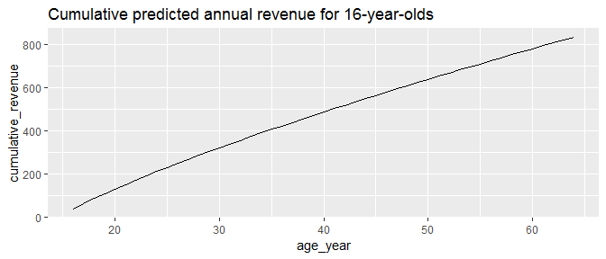
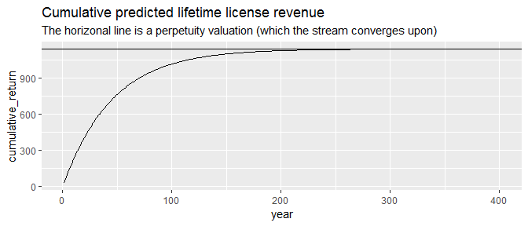
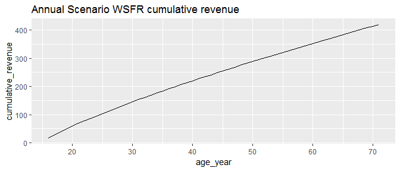
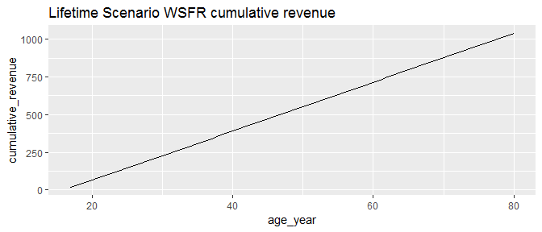

<!-- revenue.md is generated from revenue.Rmd. Please edit that file -->
Revenue Overview
================

There are 2 revenue scenarios addressed in the lifetime package, the estimates of which determine break-even prices for lifetime licenses:

-   Annual: based on predicted future retention (annual license prices)
-   Lifetime: based on the return from the license price invested in a lifetime fund (with revenue produced by interest withdrawn from fund)

WSFR Aid
--------

Agencies also potentially receive federal aid dollars based on numbers of certified hunters/anglers. These rules generally are beneficial to the lifetime license sales scenario for a number of reasons (see `?lifetime::wsfr` for details). Agencies may or may not want to consider this revenue source in their pricing analyses.

License Revenue
---------------

It's trivial to estimate a stream of annual license revenue once retention curves have been estimated. Below I assume that an adult license costs $36 and keeps up with inflation, only considering up to age 65 on the assumption that a free (or very cheap) lifetime license will be available at that age.

``` r
library(tidyverse)
library(lifetime)
data(retain_all) # retention estimates are provided in sample data
```

``` r
annual <- data.frame(current_age = 16) %>% 
    left_join(retain_all, by = "current_age") %>%
    mutate(cumulative_revenue = cumsum(36 * pct))

ggplot(annual, aes(age_year, cumulative_revenue)) + 
    geom_line() +
    ggtitle("Cumulative predicted annual revenue for 16-year-olds")
```



Estimating lifetime revenue is slightly more involved, but is basically a stream of annual returns from an invested fund. The below example assumes a 5% int. rate, from an initial license sale of $500 that depreciates at the rate of inflation (2.19%). Package lifetime includes `present_value_stream()` to calculate this revenue:

``` r
lifetime <- present_value_stream(p = 500, r = 0.05, t = 0:400, d = 0.0219)

ggplot(lifetime, aes(year, cumulative_return)) +
    geom_line() +
    geom_hline(yintercept = 500 * 0.05 / 0.0219) +
    ggtitle("Cumulative predicted lifetime license revenue",
            "The horizonal line is a perpetuity valuation (which the stream converges upon)")
```



WSFR Revenue
------------

Estimating WSFR aid dollars depends on a prediction of how much aid will be received per certified participants (wsfr\_amount), the minimum amount pricing based on regulations (min\_amount), and the price for a senior license at the senior age (senior\_price).

``` r
retain_all <- filter(retain_all, current_age == 16)

annual <- retain_all %>%
    wsfr_annual_stream(wsfr_amount = 16.25, min_amount = 2, senior_price = 15,
                       senior_age = 65, age_cutoff = 80) %>%
    mutate(cumulative_revenue = cumsum(revenue_annual))

ggplot(annual, aes(age_year, cumulative_revenue)) + 
    geom_line() +
    ggtitle("Annual Scenario WSFR cumulative revenue")
```



The lifetime scenario was more favorable under rules that existed when developing this package (see `?wsfr` details section):

``` r
lifetime <- data.frame(current_age = 16) %>%
    mutate(price_lifetime = 500) %>%
    wsfr_lifetime_stream(wsfr_amount = 16.25, min_amount = 2, age_cutoff = 80) %>%
    mutate(cumulative_revenue = cumsum(revenue_lifetime))

ggplot(lifetime, aes(age_year, cumulative_revenue)) + 
    geom_line() +
    ggtitle("Lifetime Scenario WSFR cumulative revenue")
```


